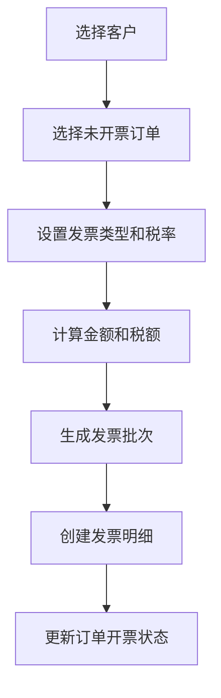

# 物流管理系统需求与实现进度

> 更新时间：2026-04-14
> 项目：供应链管理系统 - 物流管理模块
> 框架：若依 (RuoYi-Vue-Plus)

## 一、项目背景

将现有的物流运输工作台账（Excel）线上化，开发一套完整的物流管理系统。现有工作台账包含：客户、货物、司机、订单、回单、开票、结算等完整业务数据。

### 原始台账字段

| 日期 | 托运人（客户） | 装货地址 | 卸货地址 | 货名（型号） | 重量（吨） | 运价（吨/元） | 金额 | 代垫付 | 车号 | 开票日期 | 结算状态/方式 | 配载单价 | 运费支出 | 驾驶员电话 | 收款人 | 付款方式/状态 | 回单 | 备注 |

---

## 二、需求分析

### 2.1 基础数据管理

#### 2.1.1 客户管理

**功能需求：**
- 客户信息的增删改查
- 客户编码唯一性校验
- 客户状态管理（正常/停用）
- 客户信用额度设置
- 客户结算方式设置（月结/现结）
- 客户订单历史查询

**数据字段：**
- 客户ID、客户编码、客户名称、联系人、联系电话
- 客户地址、结算方式、信用额度、状态、备注

**实现进度：** ✅ 已完成

| 项目 | 状态 | 说明 |
|------|------|------|
| 数据库表 | ✅ | logistics_customer |
| 后端实体类 | ✅ | LogisticsCustomer.java |
| 后端 Mapper | ✅ | LogisticsCustomerMapper.java + XML |
| 后端 Service | ✅ | ILogisticsCustomerService.java + Impl |
| 后端 Controller | ✅ | LogisticsCustomerController.java |
| 前端 API | ✅ | api/logistics/customer.js |
| 前端页面 | ✅ | views/logistics/base/customer/index.vue |
| 菜单权限 | ✅ | 客户管理菜单及按钮权限 |

---

#### 2.1.2 货物管理

**功能需求：**
- 货物信息增删改查
- 货物编码唯一性校验
- 货物分类管理
- 货物参考价格维护
- 货物规格型号管理

**数据字段：**
- 货物ID、货物编码、货物名称、货物型号、计量单位、货物分类、参考单价、状态、备注

**实现进度：** ✅ 已完成

| 项目 | 状态 | 说明 |
|------|------|------|
| 数据库表 | ✅ | logistics_goods |
| 后端实体类 | ✅ | LogisticsGoods.java |
| 后端 Mapper | ✅ | LogisticsGoodsMapper.java + XML |
| 后端 Service | ✅ | ILogisticsGoodsService.java + Impl |
| 后端 Controller | ✅ | LogisticsGoodsController.java |
| 前端 API | ✅ | api/logistics/goods.js |
| 前端页面 | ✅ | views/logistics/goods/index.vue |
| 菜单权限 | ✅ | 货物管理菜单及按钮权限 |

---

#### 2.1.3 司机管理

**功能需求：**
- 司机信息增删改查
- 司机编码唯一性校验
- 司机银行信息管理
- 司机常用车辆关联
- 司机运输历史查询

**数据字段：**
- 司机ID、司机编码、司机姓名、司机电话、身份证号、驾驶证号、常用车牌号
- 银行账号、开户行、账户姓名、状态、备注

**实现进度：** ✅ 已完成

| 项目 | 状态 | 说明 |
|------|------|------|
| 数据库表 | ✅ | logistics_driver |
| 后端实体类 | ✅ | LogisticsDriver.java |
| 后端 Mapper | ✅ | LogisticsDriverMapper.java + XML |
| 后端 Service | ✅ | ILogisticsDriverService.java + Impl |
| 后端 Controller | ✅ | LogisticsDriverController.java |
| 前端 API | ✅ | api/logistics/driver.js |
| 前端页面 | ✅ | views/logistics/driver/index.vue |
| 菜单权限 | ✅ | 司机管理菜单及按钮权限 |

---

#### 2.1.4 车辆管理

**功能需求：**
- 车辆信息增删改查
- 车牌号唯一性校验
- 车辆载重、车长等规格管理
- 车辆状态管理（正常/维修/停用）
- 默认司机关联

**数据字段：**
- 车辆ID、车牌号、车辆类型、车长、载重、默认司机ID、状态、备注

**实现进度：** ✅ 已完成

| 项目 | 状态 | 说明 |
|------|------|------|
| 数据库表 | ✅ | logistics_vehicle |
| 后端实体类 | ✅ | LogisticsVehicle.java |
| 后端 Mapper | ✅ | LogisticsVehicleMapper.java + XML |
| 后端 Service | ✅ | ILogisticsVehicleService.java + Impl |
| 后端 Controller | ✅ | LogisticsVehicleController.java |
| 前端 API | ✅ | api/logistics/vehicle.js |
| 前端页面 | ✅ | views/logistics/vehicle/index.vue |
| 菜单权限 | ✅ | 车辆管理菜单及按钮权限 |

---

### 2.2 运输业务管理

#### 2.2.1 订单管理（核心）

**功能需求：**
- 订单信息增删改查
- **订单号自动生成**：类型(2位) + 客户编码 + 年月日 + 流水号(4位)
  - 类型编码：YS（运输）、DB（短驳）
  - 示例：YSCZGS202604140001
- 订单状态流转（pending → transporting → completed）
- **Excel 导入历史台账数据**
- 订单导出功能
- 订单结算状态管理
- 订单开票状态管理
- 订单回单状态管理
- **订单金额自动计算**：重量 × 运价

**数据字段：**
- 订单ID、订单号、订单日期、客户ID、装货地址、卸货地址
- 货物ID、货物名称、货物型号、重量、运价、总金额、代垫付金额
- 车牌号、司机ID、司机电话、配载单价、运费支出
- 结算状态、付款方式、收款人、回单状态、开票状态、开票日期、发票批次号
- 订单状态、备注

**实现进度：** ✅ 已完成

| 项目 | 状态 | 说明 |
|------|------|------|
| 数据库表 | ✅ | logistics_order |
| 后端实体类 | ✅ | LogisticsOrder.java |
| 后端 Mapper | ✅ | LogisticsOrderMapper.java + XML |
| 后端 Service | ✅ | ILogisticsOrderService.java + Impl（含订单号生成、金额计算） |
| 后端 Controller | ✅ | LogisticsOrderController.java（含导入导出） |
| 前端 API | ✅ | api/logistics/order.js |
| 前端页面 | ✅ | views/logistics/order/index.vue（列表页）|
| 前端页面 | ✅ | views/logistics/order/form.vue（表单页）|
| 菜单权限 | ✅ | 订单管理菜单及按钮权限 |

**核心逻辑实现：**
1. 订单号生成：`LogisticsOrderServiceImpl.generateOrderNo()`
2. 金额计算：`LogisticsOrderServiceImpl.calculateAmount()`
3. 数据导入：`LogisticsOrderController.importData()`
4. 独立表单页面：新增/修改订单使用独立页面而非弹窗
5. 司机联动：选择司机后自动带出车牌号和电话

---

#### 2.2.2 回单管理

**功能需求：**
- 回单列表查询
- 回单图片上传（**本地存储**）
- 回单确认
- 回单与订单关联
- 回单图片预览

**数据字段：**
- 回单ID、回单编号、订单ID、回单日期、回单图片路径、回单状态、接收人、接收时间、备注

**实现进度：** ✅ 已完成

| 项目 | 状态 | 说明 |
|------|------|------|
| 数据库表 | ✅ | logistics_receipt |
| 后端实体类 | ✅ | LogisticsReceipt.java（含订单号关联字段） |
| 后端 Mapper | ✅ | LogisticsReceiptMapper.java + XML（含联表查询） |
| 后端 Service | ✅ | ILogisticsReceiptService.java + Impl（含回单编号生成、确认功能） |
| 后端 Controller | ✅ | LogisticsReceiptController.java（含确认接口） |
| 前端 API | ✅ | api/logistics/receipt.js |
| 前端页面 | ✅ | views/logistics/receipt/index.vue |
| 菜单权限 | ✅ | 回单管理菜单及按钮权限 |

**核心逻辑实现：**
1. 回单编号生成：`LogisticsReceiptServiceImpl.generateReceiptNo()`（格式：HD + 年月日 + 流水号）
2. 回单确认：`LogisticsReceiptServiceImpl.confirmReceipt()`（更新状态为已收到）
3. 订单号联表查询：支持按订单号筛选回单
4. 图片上传：使用若依通用文件上传接口

---

#### 2.2.3 发票管理（核心）

**功能需求：**
- 发票批次创建
- **合并开票功能**：手动选择多个订单进行合并开票（支持跨客户）
- 发票批次查询
- 发票开具（更新状态为已开具）
- 发票作废（更新状态为已作废）
- **取消合并功能**：恢复订单为未开票状态
- 发票明细查询
- 发票打印（支持 PDF 导出）

**数据字段：**
- 发票批次表：批次ID、批次号、客户ID、开票日期、总金额、订单数量、发票状态、发票类型、税率、税额、备注
- 发票批次明细表：明细ID、批次ID、订单ID、订单号、金额、备注

**实现进度：** ⚠️ 部分完成（前端完成）

| 项目 | 状态 | 说明 |
|------|------|------|
| 数据库表 | ✅ | logistics_invoice_batch, logistics_invoice_detail |
| 后端实体类 | ⚠️ | 需生成 |
| 后端 Mapper | ⚠️ | 需生成 |
| 后端 Service | ⚠️ | 需生成（含合并开票逻辑） |
| 后端 Controller | ⚠️ | 需生成 |
| 前端 API | ✅ | api/logistics/invoice.js |
| 前端页面 | ✅ | views/logistics/business/invoice/index.vue |
| 菜单权限 | ✅ | 发票管理菜单及按钮权限 |

**合并开票核心逻辑（需实现）：**
```java
// 1. 选择多个未开票订单
// 2. 创建发票批次记录
// 3. 生成发票批次号（FP + 年月日 + 流水号）
// 4. 计算开票总金额和税额
// 5. 创建发票明细记录（关联订单ID）
// 6. 更新订单的开票状态和发票批次号
// 7. 支持取消合并（将订单状态恢复为未开票）
```

---

### 2.3 财务结算管理

#### 2.3.1 应收结算

**功能需求：**
- 按客户生成应收结算单
- 按时间段筛选订单
- 自动计算应收总金额
- 结算确认功能
- 结算状态管理（草稿→已确认→已完成）
- 结算单导出

**数据字段：**
- 结算表：结算ID、结算单号、客户ID、结算类型（收入）、结算日期、开始日期、结束日期、结算总金额、已付金额、未付金额、付款方式、结算状态、银行账号、账户名、备注
- 结算明细表：明细ID、结算ID、订单ID、订单号、金额、已结算金额、备注

**实现进度：** ⚠️ 部分完成（数据表完成）

| 项目 | 状态 | 说明 |
|------|------|------|
| 数据库表 | ✅ | logistics_settlement, logistics_settlement_detail |
| 后端实体类 | ⚠️ | 需生成 |
| 后端 Mapper | ⚠️ | 需生成 |
| 后端 Service | ⚠️ | 需生成 |
| 后端 Controller | ⚠️ | 需生成 |
| 前端 API | ⚠️ | 需创建 |
| 前端页面 | ⚠️ | 需创建 |
| 菜单权限 | ✅ | 应收结算菜单及按钮权限 |

---

#### 2.3.2 应付结算

**功能需求：**
- 按司机生成应付结算单
- 自动计算应付总金额（运费支出）
- 付款确认功能
- 付款记录管理

**数据字段：**
- 复用结算表和结算明细表（结算类型为支出）

**实现进度：** ⚠️ 部分完成（数据表完成）

| 项目 | 状态 | 说明 |
|------|------|------|
| 数据库表 | ✅ | logistics_settlement, logistics_settlement_detail |
| 后端实体类 | ⚠️ | 需生成 |
| 后端 Mapper | ⚠️ | 需生成 |
| 后端 Service | ⚠️ | 需生成 |
| 后端 Controller | ⚠️ | 需生成 |
| 前端 API | ⚠️ | 需创建 |
| 前端页面 | ⚠️ | 需创建 |
| 菜单权限 | ✅ | 应付结算菜单及按钮权限 |

---

#### 2.3.3 财务报表

**功能需求：**
- 应收账款明细表
- 应付账款明细表
- 利润统计表（收入 - 支出）
- 运输统计表（按时间段、客户、司机等维度）

**实现进度：** ⚠️ 未开始

| 项目 | 状态 | 说明 |
|------|------|------|
| 数据库表 | ✅ | 使用现有表 |
| 后端接口 | ⚠️ | 需开发统计接口 |
| 前端页面 | ⚠️ | 需创建 |
| 菜单权限 | ✅ | 财务报表菜单 |

---

## 三、总体进度统计

### 3.1 完成度统计

| 模块 | 数据库 | 后端 | 前端 | 总体进度 |
|------|--------|------|------|----------|
| 客户管理 | ✅ 100% | ✅ 100% | ✅ 100% | **100%** |
| 货物管理 | ✅ 100% | ✅ 100% | ✅ 100% | **100%** |
| 司机管理 | ✅ 100% | ✅ 100% | ✅ 100% | **100%** |
| 车辆管理 | ✅ 100% | ✅ 100% | ✅ 100% | **100%** |
| 订单管理 | ✅ 100% | ✅ 100% | ✅ 100% | **100%** |
| 回单管理 | ✅ 100% | ✅ 100% | ✅ 100% | **100%** |
| 发票管理 | ✅ 100% | ⚠️ 0% | ✅ 100% | **67%** |
| 应收结算 | ✅ 100% | ⚠️ 0% | ⚠️ 0% | **33%** |
| 应付结算 | ✅ 100% | ⚠️ 0% | ⚠️ 0% | **33%** |
| 财务报表 | ✅ 100% | ⚠️ 0% | ⚠️ 0% | **33%** |
| **总计** | **100%** | **60%** | **67%** | **76%** |

### 3.2 开发优先级建议

#### 第一优先级（核心业务）
1. ✅ 客户管理 - 已完成
2. ✅ 订单管理 - 已完成
3. ✅ 货物管理 - 已完成
4. ✅ 司机管理 - 已完成
5. ✅ 车辆管理 - 已完成

#### 第二优先级（业务扩展）
6. ⚠️ 发票管理 - 后端待实现（合并开票逻辑）
7. ✅ 回单管理 - 已完成

#### 第三优先级（结算报表）
8. ⚠️ 应收结算 - 全部待实现
9. ⚠️ 应付结算 - 全部待实现
10. ⚠️ 财务报表 - 全部待实现

---

## 四、技术架构

### 4.1 技术栈

**后端：**
- Spring Boot 4.0.3
- MyBatis
- MySQL
- Java 17

**前端：**
- Vue 3
- Element Plus
- Vite
- Pinia

**权限：**
- 若依权限系统（基于角色-菜单-按钮）

### 4.2 目录结构

```
supply_chain_management/
├── ruoyi-logistics/                    # 物流管理模块
│   ├── pom.xml
│   └── src/main/
│       ├── java/com/scm/logistics/
│       │   ├── domain/                 # 实体类
│       │   │   ├── LogisticsCustomer.java ✅
│       │   │   └── LogisticsOrder.java ✅
│       │   ├── mapper/                 # Mapper 接口
│       │   │   ├── LogisticsCustomerMapper.java ✅
│       │   │   └── LogisticsOrderMapper.java ✅
│       │   └── service/                # Service 层
│       │       ├── ILogisticsCustomerService.java ✅
│       │       ├── ILogisticsOrderService.java ✅
│       │       └── impl/
│       │           ├── LogisticsCustomerServiceImpl.java ✅
│       │           └── LogisticsOrderServiceImpl.java ✅
│       └── resources/mapper/logistics/  # MyBatis XML
│           ├── LogisticsCustomerMapper.xml ✅
│           └── LogisticsOrderMapper.xml ✅
│
├── ruoyi-admin/                        # 后端主模块
│   └── src/main/java/com/scm/web/controller/logistics/
│       ├── LogisticsCustomerController.java ✅
│       └── LogisticsOrderController.java ✅
│
├── ruoyi-ui/                           # 前端项目
│   └── src/
│       ├── api/logistics/               # API 接口
│       │   ├── customer.js ✅
│       │   ├── goods.js ✅
│       │   ├── driver.js ✅
│       │   ├── vehicle.js ✅
│       │   ├── order.js ✅
│       │   └── invoice.js ✅
│       └── views/logistics/             # 页面组件
│           ├── customer/index.vue ✅    # 客户管理
│           ├── goods/index.vue ✅       # 货物管理
│           ├── driver/index.vue ✅      # 司机管理
│           ├── vehicle/index.vue ✅     # 车辆管理
│           ├── order/index.vue ✅       # 订单管理（列表）
│           ├── order/form.vue ✅        # 订单管理（表单）
│           ├── invoice/index.vue ✅     # 发票管理
│           └── settlement/             # 财务结算管理
│               ├── receivable/index.vue ⚠️
│               ├── payable/index.vue ⚠️
│               └── report/index.vue ⚠️
│
├── sql/
│   └── logistics.sql ✅                 # 数据库表和菜单脚本
│
└── docs/                               # 项目文档
    ├── logistics-implementation-summary.md ✅
    ├── logistics-database-guide.md ✅
    └── logistics-backend-checklist.md ✅
```

---

## 五、快速开始

### 5.1 数据库初始化

```bash
# 执行数据库脚本
mysql -u your_username -p your_database < sql/logistics.sql
```

### 5.2 后端启动

```bash
# 编译项目
mvn clean install

# 启动服务
cd ruoyi-admin
mvn spring-boot:run
```

### 5.3 前端启动

```bash
# 安装依赖
cd ruoyi-ui
pnpm install

# 启动开发服务
pnpm dev
```

### 5.4 权限配置

1. 访问：系统管理 → 角色管理
2. 选择角色 → 修改 → 菜单权限
3. 勾选"物流管理"及其子菜单
4. 保存

---

## 六、待完成工作清单

### 6.1 后端开发（使用代码生成器）

**步骤：**
1. 访问系统 → 系统工具 → 代码生成
2. 导入表：logistics_goods, logistics_driver, logistics_vehicle 等
3. 配置生成信息
4. 生成并下载代码
5. 复制到对应目录

**需要手动实现的业务逻辑：**
- [ ] 发票合并开票功能
- [ ] 发票取消合并功能
- [ ] 结算单生成逻辑
- [ ] 财务报表统计逻辑

### 6.2 前端开发

**需要创建的页面：**
- [ ] `base/driver/index.vue` - 司机管理
- [ ] `base/vehicle/index.vue` - 车辆管理
- [ ] `business/receipt/index.vue` - 回单管理
- [ ] `settlement/receivable/index.vue` - 应收结算
- [ ] `settlement/payable/index.vue` - 应付结算
- [ ] `settlement/report/index.vue` - 财务报表

### 6.3 特殊功能实现

- [ ] 回单图片上传组件集成
- [ ] 发票打印功能（PDF 导出）
- [ ] 订单导入模板文件
- [ ] 财务报表图表展示

---

## 七、核心业务逻辑说明

### 7.1 订单号生成规则

**格式：** 类型(2位) + 客户编码 + 年月日 + 流水号(4位)

```java
// 示例：YSCZGS202604140001
// YS - 运输订单类型
// CZGS - 客户编码（常州品晟）
// 20260414 - 订单日期
// 0001 - 当天该客户的订单流水号
```

### 7.2 合并开票流程



### 7.3 订单状态流转

```
pending（待运输）
    ↓
transporting（运输中）
    ↓
completed（已完成）
    ↓
invoiced（已开票）→ settled（已结算）
```

---

## 八、相关文档

| 文档 | 说明 |
|------|------|
| [logistics-implementation-summary.md](logistics-implementation-summary.md) | 物流管理系统实现总结 |
| [logistics-database-guide.md](logistics-database-guide.md) | 数据库脚本执行指南 |
| [logistics-backend-checklist.md](logistics-backend-checklist.md) | 后端代码生成清单 |
| [工作台账.md](工作台账.md) | 物流运输工作台账原始数据 |

---

## 九、更新记录

| 日期 | 版本 | 更新内容 |
|------|------|----------|
| 2026-04-14 | v1.0 | 初始版本，完成客户管理和订单管理的完整实现 |
| 2026-04-14 | v1.1 | 完成货物、司机、车辆管理的前后端实现；优化订单管理为独立表单页面；项目整体进度从 57% 提升到 70% |
| 2026-04-14 | v1.2 | 完成回单管理的前后端实现，包括回单编号生成、回单确认、图片上传预览等功能；项目整体进度从 70% 提升到 76% |
