# 物流管理系统业务流程

> **文档类型**: 业务流程说明
> **项目**: 供应链管理系统 - 物流管理模块
> **版本**: v1.0
> **最后更新**: 2026-04-21

## 文档说明

本文档详细描述物流管理系统的完整业务流程，包括从基础数据管理到财务结算的全流程。

## 版本历史

| 版本 | 日期 | 变更内容 | 变更人 |
|------|------|----------|--------|
| v1.0 | 2026-04-21 | 初始版本，梳理完整业务流程 | System |

---

## 一、系统整体业务流程

### 1.1 核心业务流程图

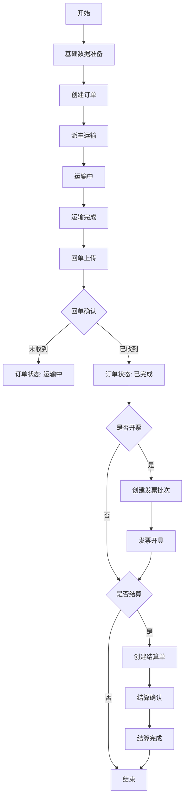

### 1.2 业务模块关系图

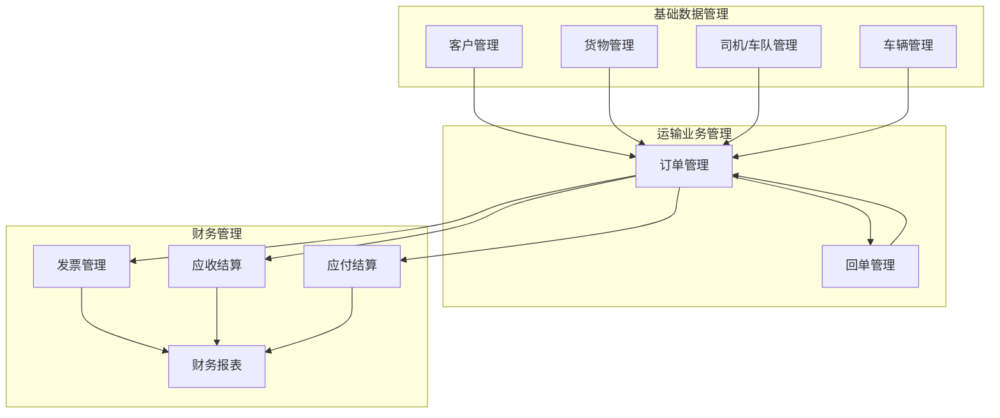

---

## 二、基础数据管理流程

### 2.1 客户管理流程

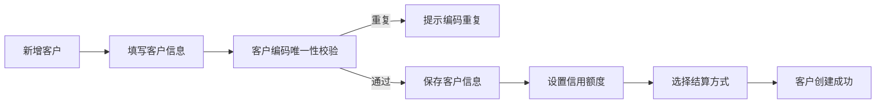

**关键业务规则**：
- 客户编码必须唯一
- 结算方式：月结/现结
- 信用额度用于控制客户欠款上限

### 2.2 司机/车队管理流程

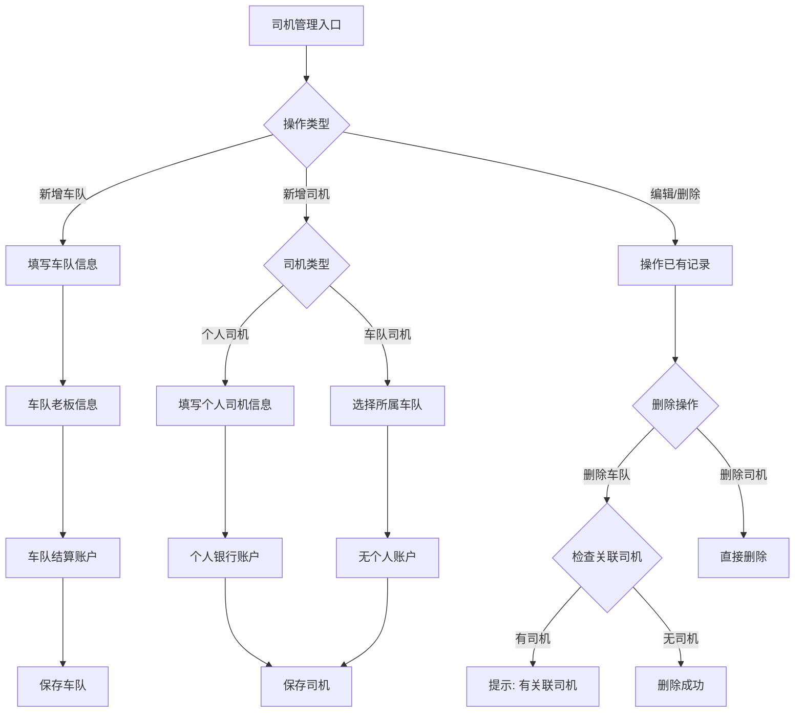

**关键业务规则**：
- 个人司机：有个人银行账户，运费结算到个人
- 车队司机：关联车队，无个人银行账户，运费结算到车队
- 删除车队前必须检查是否有关联司机
- 树形表格展示：车队（可展开）> 车队司机 + 个人司机

### 2.3 车辆管理流程

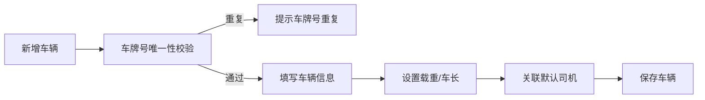

---

## 三、订单管理流程

### 3.1 订单生命周期

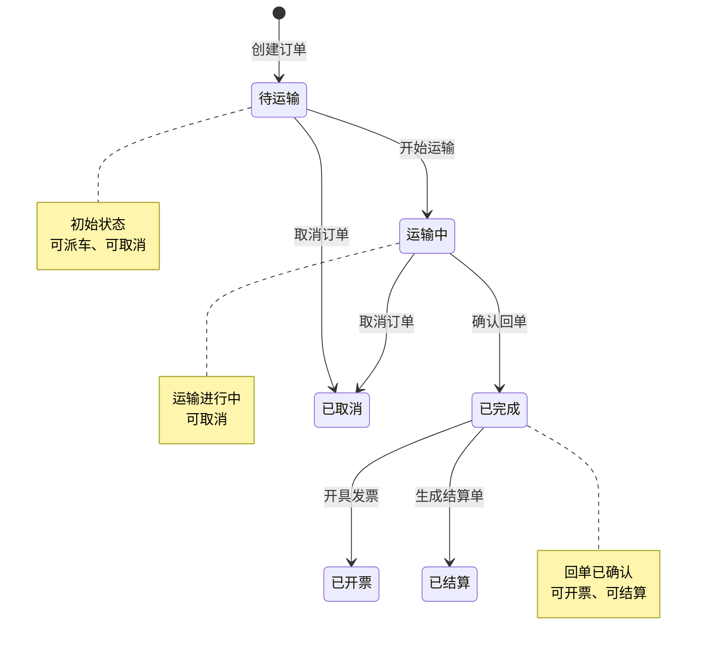

### 3.2 订单创建流程

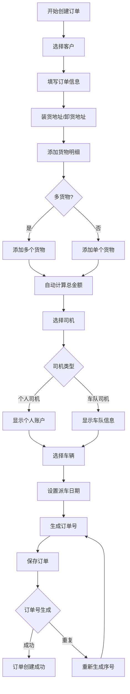

**订单号生成规则**：
- 格式：`{客户编码}-{yyyyMMdd}-{序号}`
- 示例：`RMWJ-20260416-001`
- 智能防重：自动检查数据库中是否存在（包括逻辑删除记录）

### 3.3 订单状态变更流程

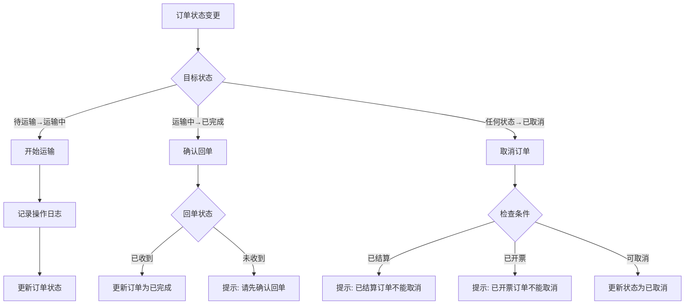

---

## 四、回单管理流程

### 4.1 回单状态流转

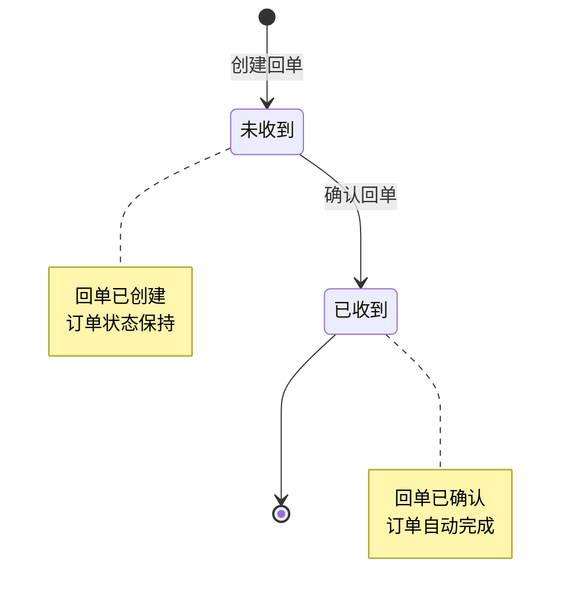

### 4.2 回单业务流程

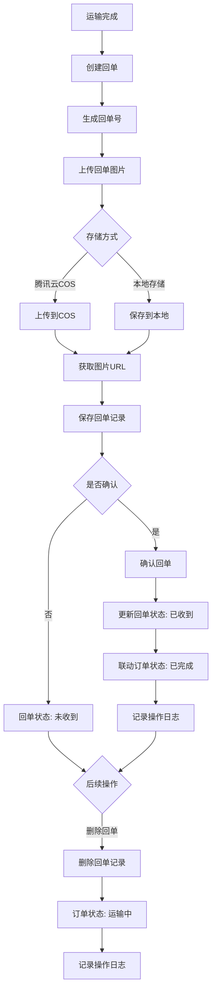

**回单号生成规则**：
- 格式：`HD + 年月日 + 4位序号`
- 示例：`HD202604140001`

**回单状态联动规则**：
- 创建回单：订单状态不变
- 确认回单：订单状态自动变为"已完成"
- 删除回单：订单状态恢复为"运输中"

---

## 五、发票管理流程

### 5.1 发票批次状态流转

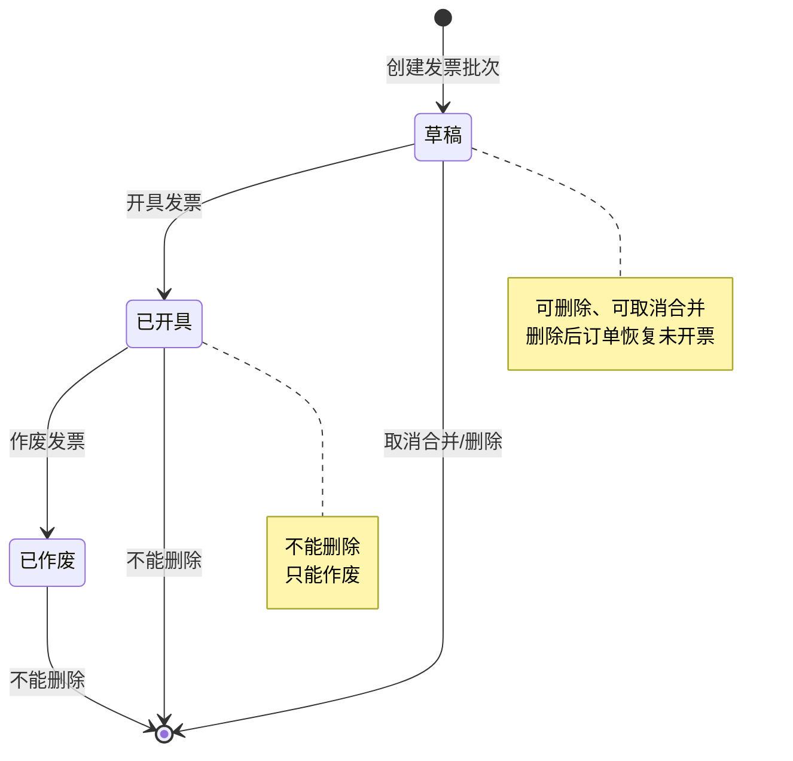

### 5.2 合并开票流程

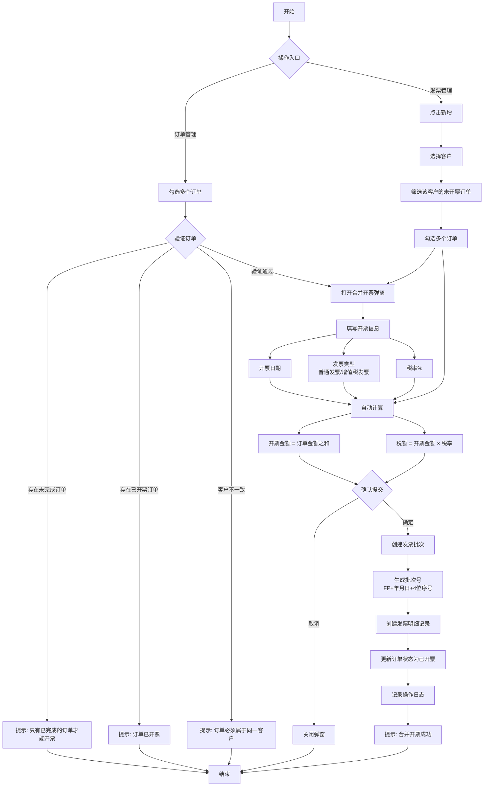

**发票批次号生成规则**：
- 格式：`FP + 年月日 + 4位序号`
- 示例：`FP202604210001`

**订单开票状态流转**：
```
未开票 → 已开票
已开票 → 未开票 (删除发票/取消合并)
```

### 5.3 发票操作权限

| 发票状态 | 可删除 | 可取消合并 | 可作废 |
|---------|--------|-----------|--------|
| 草稿 | ✅ | ✅ | ❌ |
| 已开具 | ❌ | ❌ | ✅ |
| 已作废 | ❌ | ❌ | ❌ |

---

## 六、财务结算流程

### 6.1 应收结算流程（客户）

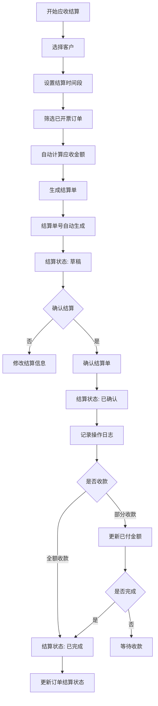

### 6.2 应付结算流程（司机）

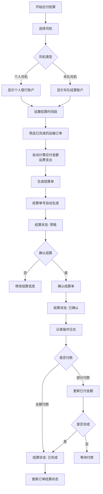

### 6.3 结算单状态流转

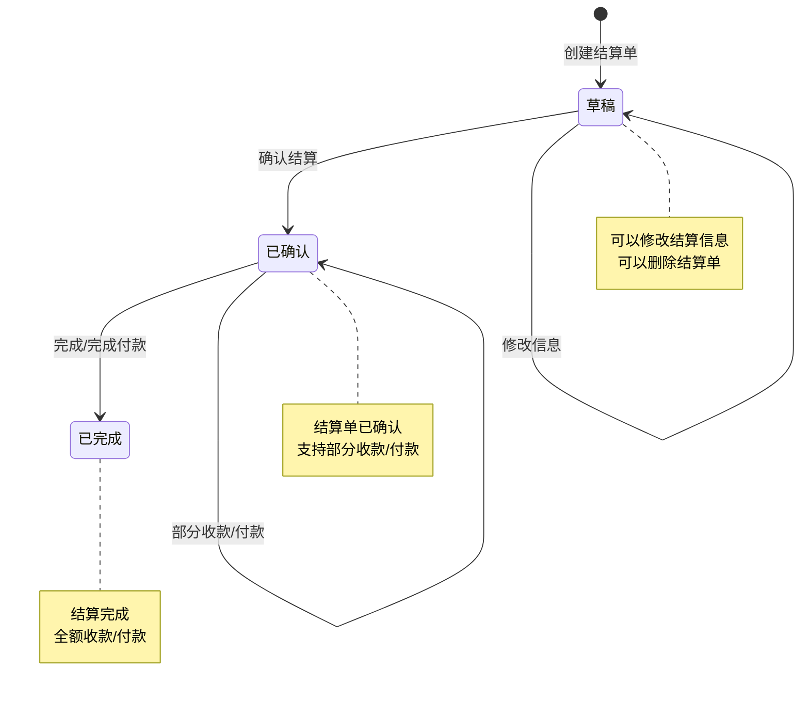

---

## 七、操作日志系统

### 7.1 日志记录类型

| 操作类型 | 代码 | 触发时机 | 记录内容 |
|---------|------|----------|----------|
| 创建订单 | create | 新增订单时 | 订单基本信息 |
| 修改订单 | update | 修改订单字段时 | 字段级变更追踪 |
| 状态变更 | status_change | 订单状态改变时 | 状态前后值 |
| 回单操作 | update | 创建/确认/删除回单 | 回单状态变更 |
| 开票操作 | invoice | 订单开票时 | 开票信息 |
| 结算操作 | settlement | 订单结算时 | 结算信息 |
| 删除订单 | delete | 删除订单时 | 删除原因 |

### 7.2 字段变更追踪

追踪的字段包括：
- 订单日期
- 客户
- 装货地址 / 卸货地址
- 司机 / 车牌号 / 司机电话
- 配载单价 / 运费支出 / 代垫付金额
- 结算状态 / 付款方式 / 收款人
- 备注

### 7.3 回单状态联动日志

| 回单操作 | 订单状态变化 | 日志记录 |
|----------|-------------|----------|
| 创建回单 | 无变化 | 记录回单创建 |
| 确认回单 | → 已完成 | 记录状态变更 + 回单确认 |
| 删除回单 | 已完成 → 运输中 | 记录状态恢复 + 回单删除 |

---

## 八、核心业务规则总结

### 8.1 订单业务规则

1. **订单号生成**：客户编码 + 日期 + 序号（3位），智能防重
2. **多货物支持**：一个订单可包含多种货物明细
3. **状态流转**：待运输 → 运输中 → 已完成 → 已开票/已结算
4. **删除保护**：已完成、已结算的订单不能删除

### 8.2 回单业务规则

1. **回单号生成**：HD + 年月日 + 4位序号
2. **状态联动**：确认回单自动完成订单
3. **存储支持**：腾讯云COS / 本地存储
4. **多图支持**：最多上传5张回单图片

### 8.3 发票业务规则

1. **批次号生成**：FP + 年月日 + 4位序号
2. **合并开票**：支持多个订单合并开票（同客户）
3. **开票前提**：订单必须已完成且未开票
4. **操作权限**：草稿可删除，已开具只能作废

### 8.4 结算业务规则

1. **应收结算**：按客户结算已开票订单
2. **应付结算**：按司机结算已完成的运输订单
3. **司机类型**：个人司机结算到个人账户，车队司机结算到车队账户
4. **部分结算**：支持部分收款/付款

---

## 九、业务异常处理

### 9.1 订单异常

| 异常情况 | 处理方式 |
|---------|---------|
| 订单号重复 | 自动重新生成序号 |
| 订单已结算 | 不能取消订单 |
| 订单已开票 | 不能取消订单 |

### 9.2 回单异常

| 异常情况 | 处理方式 |
|---------|---------|
| 回单已确认 | 不能修改回单信息 |
| 删除已确认回单 | 订单状态恢复为运输中 |

### 9.3 发票异常

| 异常情况 | 处理方式 |
|---------|---------|
| 订单未完成 | 不能开票 |
| 订单已开票 | 不能重复开票 |
| 客户不一致 | 不能合并开票 |
| 发票已开具 | 不能删除，只能作废 |

---

## 十、数据流转关系

### 10.1 订单状态机

```
待运输 (pending)
    ├─ 开始运输 → 运输中 (transporting)
    ├─ 取消 → 已取消 (cancelled)
    └─ 派车 → 已派车 (dispatched)

运输中 (transporting)
    ├─ 确认回单 → 已完成 (completed)
    └─ 取消 → 已取消 (cancelled)

已完成 (completed)
    ├─ 开具发票 → 已开票 (invoiced)
    ├─ 生成结算 → 已结算 (settled)
    └─ 取消 → 已取消 (cancelled)

已取消 (cancelled)
    └─ 终止状态
```

### 10.2 状态字段关系

| 字段 | 取值 | 说明 |
|-----|------|------|
| order_status | pending/transporting/completed/cancelled | 订单状态 |
| receipt_status | not_received/received | 回单状态 |
| invoice_status | not_invoiced/invoiced | 开票状态 |
| settlement_status | unsettled/partial/settled | 结算状态 |
| dispatch_status | not_dispatched/partial_dispatched/dispatched | 派车状态 |

---

## 附录：相关文档

- [需求文档](./01-requirements.md)
- [设计文档](./02-design.md)
- [进度文档](./03-progress.md)
- [开发规范](../../development-specs.md)
