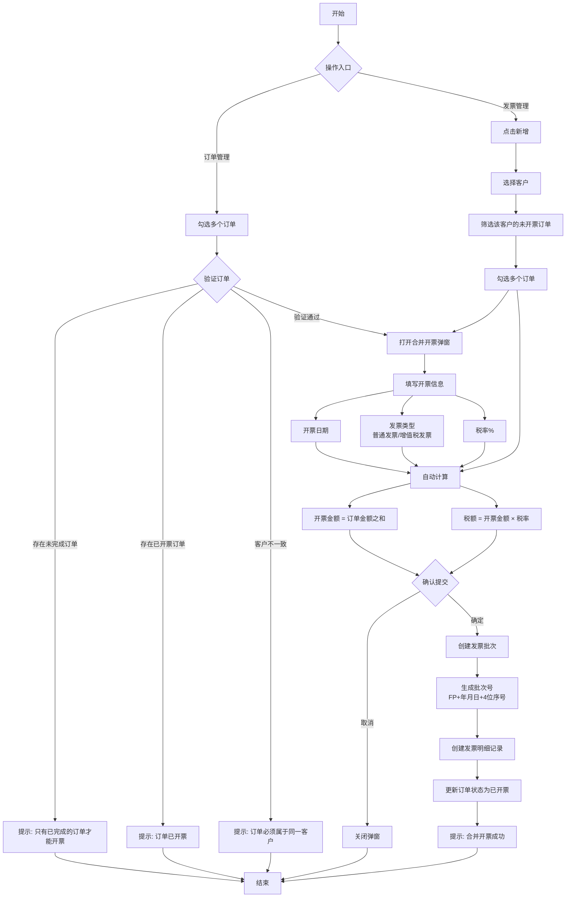
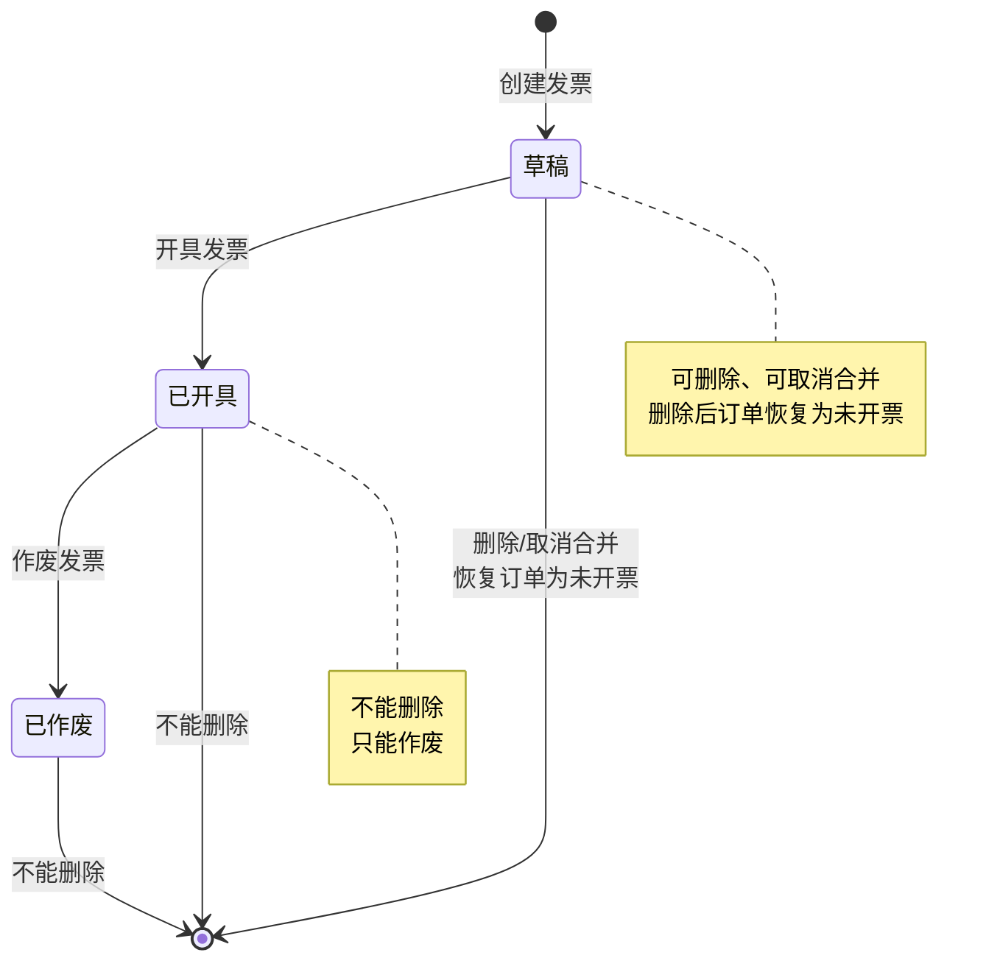
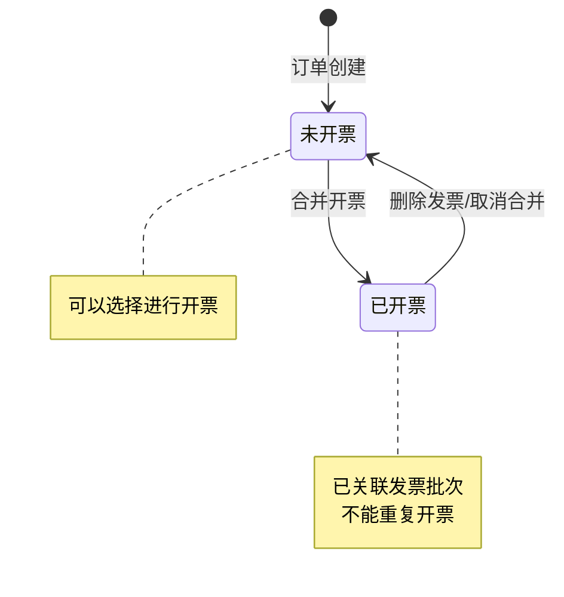

# 发票管理业务流程

## 业务流程图

## 发票状态流转图

## 订单开票状态流转图

## 核心业务规则

### 1. 订单开票前提条件
- 订单状态必须为"已完成"
- 订单开票状态必须为"未开票"
- 一次只能对同一客户的多个订单进行开票

### 2. 发票操作权限
- **草稿状态**：可以删除、可以取消合并
- **已开具状态**：不能删除、不能取消合并、只能作废
- **已作废状态**：不能删除

### 3. 订单状态联动
- 创建发票 → 订单状态变为"已开票"
- 删除发票 → 订单状态恢复为"未开票"
- 取消合并 → 订单状态恢复为"未开票"

### 4. 发票批次号生成规则
- 格式：`FP + 年月日 + 4位序号`
- 示例：`FP202604210001`
- 序号每日自动重置，从0001开始

## 接口说明

### 合并开票
- **接口**：`POST /logistics/invoice/merge`
- **参数**：
  - `customerId`: 客户ID
  - `invoiceDate`: 开票日期
  - `invoiceType`: 发票类型（ordinary/vat）
  - `taxRate`: 税率
  - `orderIds`: 订单ID列表
- **返回**：发票批次信息

### 发票开具
- **接口**：`PUT /logistics/invoice/issue/{batchId}`
- **说明**：将发票状态从"草稿"改为"已开具"

### 发票作废
- **接口**：`PUT /logistics/invoice/cancel/{batchId}`
- **说明**：将发票状态从"已开具"改为"已作废"

### 取消合并
- **接口**：`PUT /logistics/invoice/cancelMerge/{batchId}`
- **说明**：删除发票并恢复订单为未开票状态

### 删除发票
- **接口**：`DELETE /logistics/invoice/{batchId}`
- **说明**：删除发票并恢复订单为未开票状态（仅草稿状态可删除）
